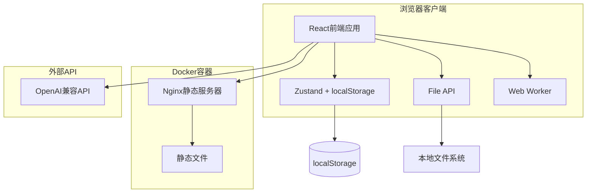

# 设计文档

## 概述

OpenAI API Lab是一个轻量级的单页Web应用，专门用于测试和调试兼容OpenAI API标准的AI平台。应用采用纯前端架构，所有数据存储在浏览器本地，支持配置和聊天记录的导入导出，可以通过Docker一键部署到服务器。

## 架构

### 技术栈选择

**前端框架：** React + TypeScript

- 组件化开发，易于维护和扩展
- TypeScript提供类型安全和更好的开发体验
- 丰富的生态系统和UI组件库

**构建工具：** Vite

- 快速的开发服务器和构建工具
- 支持热模块替换
- 优化的生产构建

**UI组件库：** Ant Design

- 提供丰富的企业级UI组件
- 良好的设计规范和用户体验
- 支持主题定制

**状态管理：** Zustand + localStorage

- 轻量级状态管理库
- 自动持久化到localStorage
- 简单易用，减少样板代码

**HTTP客户端：** Axios

- 支持请求/响应拦截器
- 自动JSON数据转换
- 支持并发请求管理

**文件处理：**

- PDF解析：pdf-parse (Web版本)
- Word文档：mammoth
- 文本编码：text-encoding
- 文件读取：FileReader API

**部署：**

- 静态文件服务：Nginx
- 容器化：Docker
- 单容器部署

### 系统架构图



## UI/UX设计规范

### 设计原则

**视觉设计**
- 主题：暗黑模式为主，提供明亮模式切换
- 色彩方案：深色背景 + 蓝色/绿色强调色
- 字体：Inter/SF Pro 系统字体，代码使用 Fira Code
- 图标：Ant Design Icons + Lucide React

**交互设计**
- 响应式布局：适配桌面(1200px+)、平板(768px+)、手机(320px+)
- 动画效果：流畅的页面切换和状态变化动画
- 加载状态：骨架屏、进度条、加载指示器
- 反馈机制：Toast通知、确认对话框、状态提示

**用户体验**
- 语言：英文界面，支持i18n国际化框架
- 导航：侧边栏导航 + 面包屑导航
- 快捷键：常用功能支持键盘快捷键
- 无障碍：ARIA标签、键盘导航、屏幕阅读器支持

### 页面布局设计

**主布局结构**
```
┌─────────────────────────────────────────┐
│ Header (Logo + Theme Toggle + Settings) │
├─────────┬───────────────────────────────┤
│         │                               │
│ Sidebar │        Main Content           │
│         │                               │
│ - Chat  │  ┌─────────────────────────┐  │
│ - Config│  │                         │  │
│ - Test  │  │     Active Page         │  │
│ - Stats │  │                         │  │
│         │  └─────────────────────────┘  │
│         │                               │
└─────────┴───────────────────────────────┘
```

**页面导航结构**
1. **Chat** - 聊天交互页面（默认首页）
2. **Configuration** - API配置管理
3. **Testing** - 性能测试和模型对比
4. **Statistics** - 使用统计和费用分析
5. **Settings** - 应用设置和数据管理

### 页面功能设计

**1. Chat Page (聊天页面)**
- 左侧：会话列表 + 新建会话按钮
- 中间：消息显示区域 + 消息输入框
- 右侧：当前模型信息 + 实时统计面板
- 底部：文件上传区域 + 快捷操作按钮

**2. Configuration Page (配置页面)**
- 顶部：配置模式切换（Simple/Advanced）
- 左侧：API配置列表 + 添加按钮
- 右侧：配置详情表单 + 连接测试
- 底部：模型列表 + 价格设置

**3. Testing Page (测试页面)**
- 顶部：测试类型选择（Performance/Comparison）
- 左侧：测试配置面板
- 中间：测试进度显示 + 实时结果
- 右侧：历史测试记录

**4. Statistics Page (统计页面)**
- 顶部：时间范围选择器
- 网格布局：使用统计卡片
- 图表区域：费用趋势、令牌消耗、响应时间
- 底部：导出功能按钮

**5. Settings Page (设置页面)**
- 分组设置：外观、语言、数据管理
- 导入导出：配置文件、聊天记录
- 高级设置：缓存管理、调试选项

### 色彩系统

**暗黑主题色彩**
```css
:root {
  /* 背景色 */
  --bg-primary: #0f0f0f;      /* 主背景 */
  --bg-secondary: #1a1a1a;    /* 卡片背景 */
  --bg-tertiary: #262626;     /* 悬停背景 */
  
  /* 文字色 */
  --text-primary: #ffffff;     /* 主要文字 */
  --text-secondary: #a3a3a3;   /* 次要文字 */
  --text-tertiary: #737373;    /* 辅助文字 */
  
  /* 强调色 */
  --accent-primary: #3b82f6;   /* 主要强调色（蓝色） */
  --accent-success: #10b981;   /* 成功色（绿色） */
  --accent-warning: #f59e0b;   /* 警告色（橙色） */
  --accent-error: #ef4444;     /* 错误色（红色） */
  
  /* 边框色 */
  --border-primary: #404040;   /* 主要边框 */
  --border-secondary: #262626; /* 次要边框 */
}
```

### 组件设计规范

**按钮设计**
- Primary: 蓝色背景，白色文字
- Secondary: 透明背景，蓝色边框
- Ghost: 透明背景，悬停时显示背景
- 尺寸：small(28px), default(32px), large(40px)

**输入框设计**
- 暗色背景，浅色边框
- 聚焦时蓝色边框高亮
- 错误状态红色边框
- 支持前缀/后缀图标

**卡片设计**
- 圆角：8px
- 阴影：subtle box-shadow
- 悬停效果：轻微上升动画
- 内边距：16px-24px

**动画规范**
- 持续时间：快速(150ms)、标准(300ms)、慢速(500ms)
- 缓动函数：ease-out（进入）、ease-in（退出）
- 页面切换：slide + fade 组合动画
- 状态变化：scale + opacity 动画

## 组件和接口

### 前端项目结构

```
src/
├── components/           # UI组件
│   ├── common/          # 通用组件
│   │   ├── Layout.tsx   # 主布局
│   │   ├── Header.tsx   # 顶部导航
│   │   └── Loading.tsx  # 加载组件
│   ├── config/          # 配置相关组件
│   │   ├── APIConfig.tsx      # API配置
│   │   ├── ModelList.tsx      # 模型列表
│   │   └── PriceConfig.tsx    # 价格配置
│   ├── chat/            # 聊天界面组件
│   │   ├── ChatWindow.tsx     # 聊天窗口
│   │   ├── MessageList.tsx    # 消息列表
│   │   ├── MessageInput.tsx   # 消息输入
│   │   └── FileUpload.tsx     # 文件上传
│   ├── testing/         # 测试功能组件
│   │   ├── PerformanceTest.tsx # 性能测试
│   │   ├── ModelComparison.tsx # 模型对比
│   │   └── TestResults.tsx     # 测试结果
│   └── stats/           # 统计显示组件
│       ├── UsageStats.tsx     # 使用统计
│       ├── CostAnalysis.tsx   # 费用分析
│       └── ExportData.tsx     # 数据导出
├── services/            # 前端服务
│   ├── api/             # API调用服务
│   │   ├── openai.ts    # OpenAI API客户端
│   │   └── models.ts    # 模型管理
│   ├── storage/         # 存储服务
│   │   ├── config.ts    # 配置存储
│   │   ├── chat.ts      # 聊天记录存储
│   │   └── export.ts    # 导入导出
│   └── utils/           # 工具函数
│       ├── file.ts      # 文件处理
│       ├── format.ts    # 格式化工具
│       └── validation.ts # 验证工具
├── stores/              # 状态管理
│   ├── configStore.ts   # 配置状态
│   ├── chatStore.ts     # 聊天状态
│   ├── testStore.ts     # 测试状态
│   └── statsStore.ts    # 统计状态
├── types/               # TypeScript类型定义
├── hooks/               # 自定义React Hooks
├── workers/             # Web Workers
│   └── fileProcessor.ts # 文件处理Worker
└── App.tsx              # 主应用组件
```

### 主要接口定义

#### API配置接口

```typescript
interface APIConfig {
  id: string;
  name: string;
  endpoint: string;
  apiKey: string;
  model?: string;
  parameters: {
    temperature?: number;
    maxTokens?: number;
    topP?: number;
    frequencyPenalty?: number;
    presencePenalty?: number;
  };
  isDefault: boolean;
  createdAt: number;
}
```

#### 模型信息接口

```typescript
interface ModelInfo {
  id: string;
  name: string;
  type: 'text' | 'multimodal' | 'embedding';
  contextLength: number;
  inputPrice?: number;
  outputPrice?: number;
  capabilities: string[];
  description?: string;
  provider: string;
  customPrice?: {
    input: number;
    output: number;
  };
}
```

#### 聊天会话接口

```typescript
interface ChatSession {
  id: string;
  title: string;
  modelId: string;
  apiConfigId: string;
  messages: ChatMessage[];
  createdAt: number;
  updatedAt: number;
  totalTokens: number;
  totalCost: number;
}

interface ChatMessage {
  id: string;
  role: 'user' | 'assistant' | 'system';
  content: string;
  attachments?: FileAttachment[];
  timestamp: number;
  tokens?: {
    input: number;
    output: number;
    total: number;
  };
  cost?: number;
  responseTime?: number;
}
```

#### 文件附件接口

```typescript
interface FileAttachment {
  id: string;
  name: string;
  type: string;
  size: number;
  content: string; // 提取的文本内容
  dataUrl?: string; // 图片的base64数据
}
```

#### 导入导出接口

```typescript
interface ExportData {
  version: string;
  exportedAt: number;
  configs?: APIConfig[];
  sessions?: ChatSession[];
  modelPrices?: Record<string, ModelPrice>;
  settings?: AppSettings;
}

interface AppSettings {
  theme: 'dark' | 'light';           // 默认暗黑主题
  language: 'en' | 'zh';             // 默认英文
  autoSave: boolean;
  maxFileSize: number;
  animations: boolean;               // 动画开关
  compactMode: boolean;              // 紧凑模式
  showStatistics: boolean;           // 显示实时统计
  keyboardShortcuts: boolean;        // 快捷键支持
}
```

## 数据模型

### 本地存储策略

**localStorage存储结构**

```typescript
// 存储键名约定
const STORAGE_KEYS = {
  API_CONFIGS: 'openai-lab-configs',
  CHAT_SESSIONS: 'openai-lab-sessions',
  MODEL_PRICES: 'openai-lab-prices',
  APP_SETTINGS: 'openai-lab-settings',
  USAGE_STATS: 'openai-lab-stats'
};
```

**数据持久化策略**

- 配置变更时自动保存到localStorage
- 聊天消息实时保存
- 定期清理过期数据
- 支持数据压缩存储

**导入导出功能**

- JSON格式的配置文件
- 聊天记录Markdown导出
- 统计数据CSV导出
- 完整数据备份

### 文件处理策略

**支持的文件类型**

- 文本文件：.txt, .md, .json
- 文档文件：.pdf, .docx
- 图片文件：.png, .jpg, .jpeg, .gif, .webp
- 音频文件：.mp3, .wav, .m4a

**文件处理流程**

1. 文件选择和验证
2. Web Worker中处理文件
3. 提取文本内容或转换格式
4. 缓存处理结果
5. 清理临时数据

## 错误处理

### 网络错误处理

**API调用错误**

- 连接超时：显示重试选项
- 认证失败：提示检查API密钥
- 限流错误：显示等待时间
- 服务器错误：显示友好错误信息

**CORS问题处理**

- 提供CORS代理配置说明
- 支持自定义代理服务器
- 浏览器扩展解决方案提示

### 数据错误处理

**存储空间不足**

- 监控localStorage使用量
- 自动清理旧数据
- 提示用户导出数据

**数据损坏恢复**

- 数据格式验证
- 自动修复机制
- 备份数据恢复

### 文件处理错误

**文件格式错误**

- 文件类型验证
- 格式转换失败处理
- 提供支持格式说明

**文件大小限制**

- 前端文件大小检查
- 分块处理大文件
- 内存使用优化

## 测试策略

### 单元测试

**组件测试**

- React Testing Library
- 用户交互测试
- 状态变化测试

**服务测试**

- API调用模拟
- 存储服务测试
- 文件处理测试

### 集成测试

**端到端测试**

- Playwright自动化测试
- 完整用户流程测试
- 跨浏览器兼容性测试

**性能测试**

- 大文件处理性能
- 长时间运行稳定性
- 内存泄漏检测

## 部署方案

### 静态托管部署（推荐）

**GitHub Pages部署**
- 自动化CI/CD通过GitHub Actions
- 免费托管静态网站
- 支持自定义域名
- 自动HTTPS证书

**Vercel部署**
- 零配置部署
- 全球CDN加速
- 自动预览部署
- 优秀的开发体验

**Netlify部署**
- 拖拽部署支持
- 表单处理功能
- 边缘函数支持
- 免费SSL证书

### Docker部署

**Dockerfile**

```dockerfile
# 多阶段构建
FROM node:18-alpine AS builder
WORKDIR /app
COPY package*.json ./
RUN npm ci
COPY . .
RUN npm run build

FROM nginx:alpine
COPY --from=builder /app/dist /usr/share/nginx/html
COPY nginx.conf /etc/nginx/nginx.conf
EXPOSE 80
CMD ["nginx", "-g", "daemon off;"]
```

**docker-compose.yml**

```yaml
version: '3.8'
services:
  openai-api-lab:
    build: .
    ports:
      - "80:80"
    restart: unless-stopped
    environment:
      - NODE_ENV=production
```

### Nginx配置

**nginx.conf**

```nginx
server {
    listen 80;
    server_name localhost;
    root /usr/share/nginx/html;
    index index.html;
  
    # SPA路由支持
    location / {
        try_files $uri $uri/ /index.html;
    }
  
    # 静态资源缓存
    location /assets/ {
        expires 1y;
        add_header Cache-Control "public, immutable";
    }
  
    # 安全头
    add_header X-Frame-Options "SAMEORIGIN";
    add_header X-Content-Type-Options "nosniff";
    add_header X-XSS-Protection "1; mode=block";
}
```

### 一键部署脚本

**deploy.sh**

```bash
#!/bin/bash
echo "部署 OpenAI API Lab..."

# 构建Docker镜像
docker build -t openai-api-lab .

# 停止旧容器
docker stop openai-api-lab 2>/dev/null || true
docker rm openai-api-lab 2>/dev/null || true

# 启动新容器
docker run -d \
  --name openai-api-lab \
  -p 80:80 \
  --restart unless-stopped \
  openai-api-lab

echo "部署完成！访问 http://localhost 使用应用"
```

### 环境要求

**最小系统要求**

- Docker 20.10+
- 内存：512MB
- 存储：100MB
- 网络：支持HTTPS出站连接

**推荐配置**

- 内存：1GB+
- 存储：1GB+
- CPU：1核心+
- 带宽：10Mbps+

### GitHub Actions自动部署

**.github/workflows/deploy.yml**
```yaml
name: Deploy to GitHub Pages

on:
  push:
    branches: [ main ]
  pull_request:
    branches: [ main ]

jobs:
  build-and-deploy:
    runs-on: ubuntu-latest
    
    steps:
    - name: Checkout
      uses: actions/checkout@v3
      
    - name: Setup Node.js
      uses: actions/setup-node@v3
      with:
        node-version: '18'
        cache: 'npm'
        
    - name: Install dependencies
      run: npm ci
      
    - name: Build
      run: npm run build
      
    - name: Deploy to GitHub Pages
      uses: peaceiris/actions-gh-pages@v3
      if: github.ref == 'refs/heads/main'
      with:
        github_token: ${{ secrets.GITHUB_TOKEN }}
        publish_dir: ./dist
```

### Vercel部署配置

**vercel.json**
```json
{
  "buildCommand": "npm run build",
  "outputDirectory": "dist",
  "framework": "vite",
  "rewrites": [
    {
      "source": "/(.*)",
      "destination": "/index.html"
    }
  ],
  "headers": [
    {
      "source": "/assets/(.*)",
      "headers": [
        {
          "key": "Cache-Control",
          "value": "public, max-age=31536000, immutable"
        }
      ]
    }
  ]
}
```

### 部署选项对比

| 平台 | 优势 | 适用场景 |
|------|------|----------|
| **GitHub Pages** | 免费、与代码仓库集成、自动部署 | 开源项目、个人使用 |
| **Vercel** | 零配置、全球CDN、预览部署 | 快速原型、生产环境 |
| **Netlify** | 拖拽部署、表单处理、边缘函数 | 静态网站、JAMstack |
| **Docker** | 完全控制、私有部署、自定义配置 | 企业内部、私有服务器 |

### CORS解决方案

由于浏览器的CORS限制，直接调用OpenAI API可能遇到问题，提供以下解决方案：

**1. 浏览器扩展**
- 安装CORS解除扩展（开发测试用）
- 不推荐生产环境使用

**2. 代理服务**
- 使用Cloudflare Workers作为代理
- 部署简单的CORS代理服务
- 配置反向代理

**3. 本地开发**
- 使用Vite的代理配置
- 开发时绕过CORS限制

### 环境要求

**静态托管部署**
- Node.js 18+（构建时）
- 无运行时服务器要求
- 支持HTTPS的CDN

**Docker部署**
- Docker 20.10+
- 内存：512MB
- 存储：100MB
- 网络：支持HTTPS出站连接